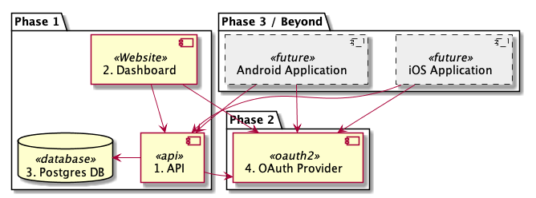

# My Recovery
This repository describes the architecture for a personalized recovery app.

This is an application to enable a user or users to create their own goals,
reminders and tasks. The user makes progress on each of these goals during
a predetermined time. The user can see their progress and make sure they're
'on-track'.

## Components
There are a number of planned components for this application.

### Phase 1
The initial prototype application.

#### 1. Website
This is a mobile-first website. This is the primary interface for this
application, it is the first one being developed.

Plans are to build this in reason-react, as a static site.

#### 2. API
This is the backing API, it will allow the user to save progress and load
personal information.

Plans are to build this out in go-lang, perhaps using graphql.

#### 3. Database
This is the primary database for the backing api.

Plans are to use postgres.

### Phase 2
Once the prototype is built and working, I'll expand this to have
authentication. Not sure what this will be, but I want to use something
off-the-shelf.

#### 4. OAuth Provider
This an external OAuth provider, used to grant access and be the authentication
provider. Plans are to use an out-of-the-box solution.

### Phase 3 / Beyond
Once the OAuth provider is built, this app will be 'complete' from an MVP.
If I end up building this and like it / want to expand, I'll add native mobile
apps, perhaps even desktop ones.
